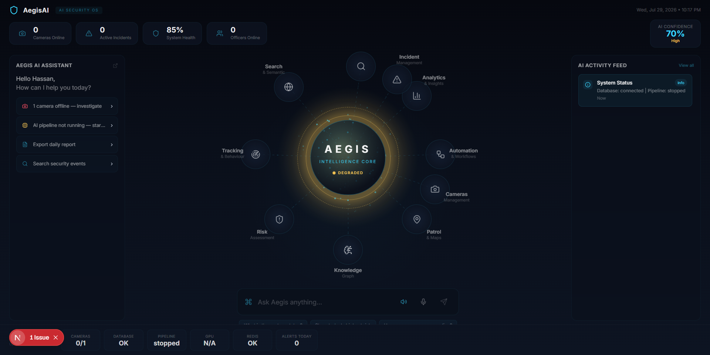

# AegisAI

> An AI-assisted security operations platform for analysing camera feeds, tracking activity, prioritising risk, and giving operators a live view of system health.



AegisAI combines a FastAPI backend, a computer-vision pipeline, and a Next.js operations dashboard. It is designed to help authorised operators investigate events and make informed decisions; it is not intended to make autonomous enforcement decisions.

## What it does

- Connects to and manages camera sources, including live browser capture and stream-backed cameras.
- Runs object detection and tracking with Ultralytics YOLO and ByteTrack-compatible tracking components.
- Records detections, tracks, events, alerts, recordings, and risk-scoring data.
- Provides semantic evidence search and optional visual verification.
- Exposes a real-time REST and WebSocket API with API-key protection and rate limiting.
- Offers a Next.js dashboard for cameras, alerts, analytics, events, tracks, semantic search, and an AI intelligence workspace.
- Supports natural-language and voice-command workflows through an optional Gemini-powered AI orchestrator.

## Architecture

```text
Camera sources / uploaded frames
             |
             v
  Detection -> Tracking -> Risk scoring -> Alerts / events
             |                                  |
             v                                  v
     SQLite or PostgreSQL                 Redis event bus
             \                                  /
              v                                v
                  FastAPI + WebSockets
                           |
                           v
                Next.js operations dashboard
```

## Technology

| Area | Components |
| --- | --- |
| Frontend | Next.js 16, React 19, TypeScript, Tailwind CSS, Framer Motion |
| API | FastAPI, Uvicorn, Pydantic, SlowAPI |
| Vision | Ultralytics YOLO, OpenCV, Supervision |
| Data | SQLAlchemy, SQLite by default, PostgreSQL for production, Alembic |
| Events and cache | Redis (optional for local development) |
| AI | Optional Google Gemini integration for the AI assistant |

## Quick start

### Prerequisites

- Python 3.10 or later
- Node.js 18 or later
- An API key value for local requests
- Optional: Redis and PostgreSQL
- Optional: a Gemini API key for AI-generated responses

### 1. Configure the backend

Copy the example environment file and set a non-default API key:

```powershell
Copy-Item .env.example .env
```

Set at least these values in `.env`:

```dotenv
AEGIS_API_KEY=replace-with-a-local-development-key
AEGIS_DEBUG=true
AEGIS_API_HOST=127.0.0.1
AEGIS_API_PORT=8080
DATABASE_URL=sqlite:///data/aegis.db
```

`SQLite` is the default local database. Redis and Gemini are optional; features that depend on them report their availability rather than requiring them to start the API.

### 2. Install and run the API

```powershell
python -m venv venv
.\venv\Scripts\Activate.ps1
pip install -r requirements.txt
python start_api.py
```

The API runs at `http://127.0.0.1:8080`. With `AEGIS_DEBUG=true`, interactive API documentation is available at `http://127.0.0.1:8080/docs`.

To enable semantic support for a local run:

```powershell
python start_api.py --enable-semantic
```

### 3. Configure and run the dashboard

The dashboard proxy reads server-only connection details. For local monorepo
development, it securely uses the root `.env` configured above. If you run the
frontend separately, create `frontend/.env.local` instead:

```dotenv
AEGIS_API_URL=http://127.0.0.1:8080
AEGIS_API_KEY=replace-with-a-local-development-key
```

Then start the frontend:

```powershell
Set-Location frontend
npm install
npm run dev
```

Open `http://localhost:3000`.

The dashboard forwards API requests through its same-origin server route. `AEGIS_API_KEY` is read only by that server route and must never be configured with a `NEXT_PUBLIC_*` name. In production, inject both server-only variables into the dashboard process; the local root `.env` fallback is disabled. Production deployments still need real dashboard session authentication and role-based access control; the proxy is not a substitute for those controls.

Gemini Live native-audio voice setup, security boundaries, supported commands, and verification steps are documented in [Gemini Live Intelligence](docs/GEMINI_LIVE_INTELLIGENCE.md).

## Verifying the installation

Health probes do not require an API key:

```powershell
Invoke-WebRequest http://127.0.0.1:8080/healthz
Invoke-WebRequest http://127.0.0.1:8080/readyz
```

Protected API endpoints require `X-API-Key`:

```powershell
$headers = @{ "X-API-Key" = "replace-with-a-local-development-key" }
Invoke-WebRequest http://127.0.0.1:8080/status -Headers $headers
```

## Key API areas

Most endpoints require `X-API-Key`; the health probes are deliberately unauthenticated for orchestration platforms.

| Area | Examples |
| --- | --- |
| Service state | `GET /status`, `GET /healthz`, `GET /readyz` |
| Cameras | Camera configuration, snapshots, stream frames, and events under `/cameras` and `/ws/cameras/...` |
| Operations data | `/events`, `/tracks`, `/detections`, `/alerts`, `/recordings`, `/statistics` |
| Pipeline | Monitoring and control under `/pipeline` |
| Intelligence | `GET /api/intelligence/context`, `/semantic`, and natural-language query endpoints |
| AI assistant | `POST /api/ai/chat`, `POST /api/ai/voice`, `GET /api/ai/context`, `GET /api/ai/suggestions` |
| Real time | `/ws` plus camera-specific WebSocket endpoints |

When debug mode is enabled, use `/docs` as the source of truth for available request schemas and endpoint details.

## Configuration

The complete template is in [`.env.example`](.env.example). The most important settings are:

| Variable | Purpose |
| --- | --- |
| `AEGIS_API_KEY` | API-key value required by protected backend routes |
| `AEGIS_ALLOWED_ORIGINS` | Comma-separated browser origins allowed by CORS |
| `AEGIS_DEBUG` | Enables development mode and OpenAPI documentation |
| `AEGIS_API_HOST`, `AEGIS_API_PORT` | Backend bind address and port |
| `DATABASE_URL` | SQLAlchemy connection URL; SQLite is suitable for development |
| `REDIS_URL` | Redis connection for cache and event-bus features |
| `GEMINI_API_KEY` | Enables Gemini-backed AI assistant capabilities |
| `SEMANTIC_ENABLED` | Enables semantic evidence-query components |
| `AEGIS_API_URL` | Server-only API base URL used by the Next.js dashboard proxy |

## Database initialization and migrations

Alembic is reserved for schema migrations. The current repository does not yet
ship an initial Alembic migration for the active `aegis.database` schema, so a
fresh local database needs one explicit initialization before durable events
can be written:

```powershell
python -c "from aegis.database.connection import create_tables; create_tables()"
```

For a deployment with Alembic migrations installed, apply them after that
initial baseline is available:

```powershell
.\venv\Scripts\alembic.exe upgrade head
```

## Tests and builds

Run backend tests:

```powershell
pytest tests -v
```

Build the frontend for production:

```powershell
Set-Location frontend
npm run build
```

## Containers

`docker-compose.yml` starts PostgreSQL, Redis, and the API on port `8080`:

```powershell
docker compose up --build
```

The dashboard is developed and built as a Next.js application. Run it with `npm run dev` locally or deploy its Next.js build with a Next-compatible runtime. The Compose Nginx frontend volume is retained for a separately produced static frontend artifact; it does not build the current Next.js application.

## Repository layout

```text
aegis/                 FastAPI app, vision pipeline, AI, database, and API routes
alembic/               Database migration scripts
data/                  Local database, recordings, and runtime data
frontend/              Next.js dashboard
models/                Optional model assets
tests/                 Backend test suite
start_api.py           Local API entry point
docker-compose.yml     PostgreSQL, Redis, and API services
```

## Security and responsible use

- Keep `.env` and all API keys out of version control.
- Use a unique, strong `AEGIS_API_KEY` in every environment.
- Restrict `AEGIS_ALLOWED_ORIGINS` to known dashboard origins in production.
- Terminate TLS in front of the API and secure WebSocket traffic with `wss://`.
- Follow applicable privacy, consent, data-retention, and surveillance laws before connecting real camera feeds.

## License

Proprietary — all rights reserved.
